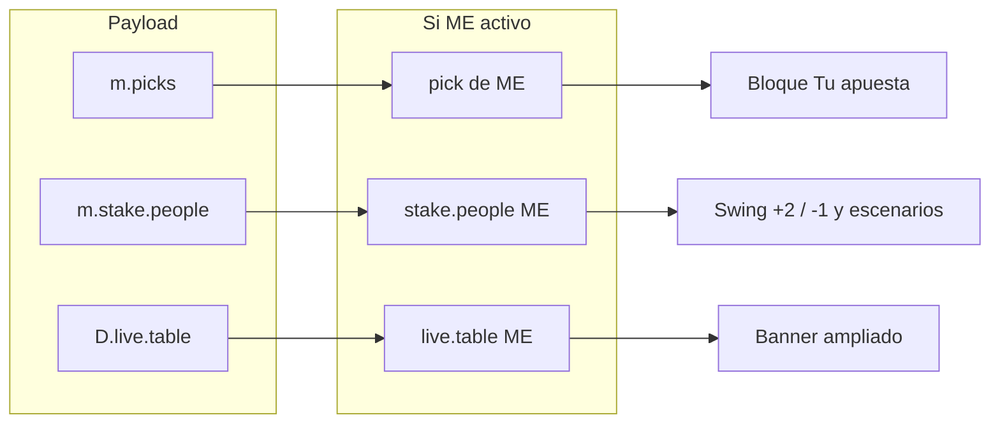

# Personalización por usuario — mapa de métricas

Documento de diseño para la **segunda vuelta** de personalización: dónde meter al usuario (`ME`, desde `localStorage` / `?user=`) más allá del resaltado visual actual.

**Estado:** propuesta · no implementado  
**Relacionado:** plan `usuario_actual_porra`, [`ANALISIS_ELIMINATORIAS.md`](ANALISIS_ELIMINATORIAS.md)

---

## 1. Qué ya tenemos (v1)

| Elemento | Comportamiento |
|---|---|
| Selector + modal | `ME` persistido, deep link `?user=Nombre` |
| Banner **Tu resumen** (live) | Puesto, pts, último Δ, gemelo, # rebeldía |
| Carrera en directo | Fila fija `race-me-pin` + clase `is-me` en la lista |
| Picks / pills | `ME` primero en cada bucket + borde mint |
| Rankings / barras / matriz / fichas | Resaltado `is-me` |
| Fichas | Pre-relleno búsqueda + scroll si `#fichas` |

La v1 responde *“¿dónde estoy?”*. La v2 debe responder *“¿qué me pasa a mí con esto?”*.

---

## 2. Principio de diseño

1. **Priorizar datos que ya existen en `window.__PORRA__`** — muchas métricas por persona ya se calculan en Python; hoy solo se muestran agregadas o para “el ganador del swing global”.
2. **Live primero** — es la pestaña por defecto y la que más se consulta durante el torneo.
3. **Copy en segunda persona** — “Tu pick”, “Podrías subir 2 puestos”, no repetir el nombre en cada línea si `ME` está activo.
4. **Sin auth** — todo es orientativo; cualquía puede elegir cualquier nombre.

---

## 3. Inventario de datos por persona (ya en el payload)

### 3.1 Global / ficha (`D.cards`, `D.matrix`, `D.rebeldia`, …)

| Fuente | Campos útiles para `ME` |
|---|---|
| `D.cards[]` | `rebel_rank`, `rebel_index`, `avg_goals`, `pct_draws`, `lobo`, `twin`, `twin_pct`, `biggest` (apuesta loca) |
| `D.live.table[]` | `rank`, `pts`, `delta`, `exact`, `sign`, `standings_pts`, `thirds_pts`, `ko_*`, desglose por fase |
| `D.live.progression[].table[]` | Por snapshot: `round_pts`, `delta`, `round_exact`, `round_sign`, … |
| `D.twins[]` | Pares gemelo con `%` similitud |
| `D.knockout.metrics.people[]` | `champ`, `runner`, `ts`, `boldPct`, `fell`, `bracket[]`, `exp`, `variance`, `vsPueblo`, `reventador` |
| `D.knockout.scoring.table[]` | Puntos KO reales por persona |
| `D.awards` | Si `ME` tiene algún premio honorífico |

### 3.2 Partido de hoy (`D.today.matches[]`, KO en schedule)

| Campo | Uso personal |
|---|---|
| `picks[]` | Pick de `ME`: `{ name, home, away, winner?, winner_flag? }` |
| `outcome_dist`, `modal_scoreline` | “Vas con el pueblo” vs “Discrepas del consenso” |
| `most_unique_pick` | ¿Eres tú el más atrevido en este partido? |
| **`stake`** (si partido sin jugar y hay `D.live`) | Ver §4 — **joya enterrada** |

### 3.3 Stake por partido (`m.stake` / `compute_match_stake`)

Generado en `_compute_scenario_stake` → `stake.people[]` **por participante**:

```text
name, max_pts, swing_up, swing_down,
best_result { score, winner?, winner_flag? },
worst_result { … }
```

En KO además: `score`, `winner`, `winner_flag` por persona.

A nivel global del partido (hoy en UI):

```text
max_swing, min_swing, max_swing_who, min_swing_who,
max_swing_result, min_swing_result
```

→ La UI muestra el **máximo del grupo**, no **tu** swing. El dato personal ya está en `stake.people`.

### 3.4 Últimos resultados (`D.recent_results.matches[]`)

Por partido: listas `exact`, `sign`, `miss`, `advance` con `{ name, pick }`.

### 3.5 Eliminatorias en juego hoy

Cruces KO del día llevan `stake` vía `stake_for_ko_match` con la misma estructura `people[]`.

---

## 4. Vista **En directo** — propuestas concretas

### 4.1 Banner “Tu resumen” (ampliar el actual)

| Métrica | Fuente | Copy ejemplo |
|---|---|---|
| Distancia al líder | `live.table[0].pts - me.pts` | “A 6 pts del líder” |
| Mejor escenario hoy | sumar `stake.people[ME].swing_up` del día | “Hoy puedes ganar hasta +2 puestos” |
| Peor escenario hoy | sumar swings down | “O perder hasta 1” |
| Partidos hoy con pick | filtrar `todayScheduleMatches()` | “3 partidos con tu apuesta” |
| Último pleno / signo | recorrer `recent_results` | “Último acierto: pleno ESP 2-1” |
| Pts en juego hoy | Σ `stake.people[ME].max_pts` | “Hasta +12 pts repartibles hoy” |

**Esfuerzo:** solo JS (filtrar/agregar sobre payload existente).

---

### 4.2 Sección **Hoy** — bloque “Tu partido” por cruce

Encima o debajo del bloque de stake global, **si `ME` tiene pick**:

```
┌─ Tu apuesta ─────────────────────────────┐
│ 2-1 · gana local                         │
│ Consenso: 1-1 (34%)  →  Discrepas ✓      │
│ En juego: hasta +4 pts · +2 / −1 puestos │
│   si sale 2-1 subes 2 · si sale 1-1 bajas 1 │
└──────────────────────────────────────────┘
```

| Dato | Origen |
|---|---|
| Pick | `picks.find(p => p.name === ME)` |
| Consenso | `modal_scoreline` + share |
| Swing personal | `stake.people.find(p => p.name === ME)` |
| Mejor/peor resultado | `best_result` / `worst_result` (ya formateados) |

**Caso sin stake** (partido jugado o deferred): mostrar solo pick + si acertó ( cruzar con `recent_results` o resultado en `m.result` ).

**Caso `stake.deferred`:** “Tu swing se calcula cuando caigan los resultados anteriores de hoy” + listar pick igualmente.

**Prioridad:** 🔴 alta — es el ejemplo que pediste (“swing máximo personalizado”).

---

### 4.3 Stake global del partido — reorientar copy

Hoy: `+3 / −2 puestos` + hint con **nombre ajeno** (`max_swing_who`).

Con `ME`:

- Sustituir o complementar con **tu línea** en grande.
- Dejar la global en muted: “En la porra, quien más se juega es Ana (+3)”.
- En KO: la lista “Más en juego” ya filtra top 4; **subir `ME` al top** si está en juego aunque no sea top 4.

---

### 4.4 Carrera partido a partido

| Idea | Detalle |
|---|---|
| **Panel lateral “En este paso”** | Al mover el slider, leer `progression[i].table` → fila `ME`: `round_pts`, `delta`. Copy: “En este partido: +4 pts, subiste 1”. |
| **Marcador en la barra de control** | Sustituir uno de los 3 chips de `race-now` cuando `ME`: “Tú: +2 pts este paso”. |
| **Autoscroll suave** | Opcional: al abrir live, slider al último paso donde `ME.round_pts > 0`. |
| **Historial personal** | Mini timeline: últimos 5 pasos con icono ▲/▼ según `delta` de `ME`. |

**Esfuerzo:** solo JS; `D.live.progression` ya tiene todo.

---

### 4.5 Últimos resultados

Por tarjeta de partido, **strip compacto para `ME`**:

| Resultado | Copy |
|---|---|
| En `exact` | “✓ Pleno — apostaste 2-1” |
| En `sign` | “~ Signo — apostaste 1-0” |
| En `miss` | “✗ Fallaste — tenías 0-2” |
| KO `advance` | “✓ Acertaste el pase” |

Evita buscar tu pill entre 28 nombres (hoy solo resaltada).

---

### 4.6 Ranking en directo (debajo del banner)

| Idea | Fuente |
|---|---|
| “Te pasa X por 1 pt” | vecino en `live.table` |
| Desglose pts (ya en tooltip) | volcar a mini-card bajo el pin: grupos / clasificados / KO |
| Proyección “si aciertas todo lo pendiente hoy” | sumar `max_pts` de stakes del día (aproximación optimista) |

---

## 5. Vista **Fase de grupos**

Aquí el usuario entra menos en caliente, pero la ficha ya existe.

| Sección | Personalización propuesta |
|---|---|
| **Hero** | Chip extra si `ME`: “Tu índice rebeldía: 73” |
| **Rebeldía** | Línea “Estás #4 de 28” + distancia al 🐺 |
| **Afinidad** | Destacar fila/columna `ME` (hecho) + callout “Tu gemelo: X (89%)” arriba de la matriz |
| **Estilo** | “Tú: 2.8 goles/partido — más goleador que el 70%” |
| **Partidos divisivos** | Por cada partido divisivo: “Tú pusiste 2-2; el pueblo: 1-0” — requiere **nuevo cálculo** o filtrar picks en JS desde `D.today.matches` / matches meta |
| **Lobo** | “Llevas N apuestas únicas” si `ME` en ranking |
| **Fichas** | Ir directo a la tuya (hecho parcial) + ancla “Tu locura” |
| **Palmarés** | Badge “🏅 Tienes un premio: El Rebelde” si `awards.*.name === ME` |

**Esfuerzo:** mayoría JS; “tu pick en partidos divisivos” puede necesitar exponer picks por partido en `D.divisive[]` (hoy solo agregados).

---

## 6. Vista **Eliminatorias**

`D.knockout.metrics.people[]` es muy rico; casi todo es por persona.

| Acto / bloque | Personalización |
|---|---|
| **Acto 4 — Tu cuadro** | Filtrar tabla supervivencia a **solo fila `ME`** arriba del grid completo (modo “mi cuadro”) |
| **Campeón / cementerio** | “Tu campeón: España — cae en QF” / “⚰️ Tu campeón ya está fuera” |
| **Riesgo vs recompensa** | Etiquetar el dot de `ME` + resumen: “Riesgo 67/100 · 42 pts KO esp.” |
| **Atrevimiento** | “Vas un 23% fuera del consenso (8/35 cruces)” |
| **Profeta / scoring** | “Vas #3 en puntos KO” |
| **Honores** | Resaltar si `ME` es profeta, agorero, reventador, etc. |
| **Calendario / stake KO hoy** | Mismo patrón que §4.2 para cruces del día |
| **Progresión KO** (`knockout.progression`) | Igual que carrera live: “En R32-M3 sumaste +8” |

**Esfuerzo:** JS; datos ya en `metrics.people` y `progression`.

---

## 7. Matriz prioridad × esfuerzo

| # | Feature | Vista | Datos | UI | Prioridad |
|---|---|---|---|---|---|
| 1 | **Swing personal en partido de hoy** | Live / Hoy | ✅ `stake.people` | Bloque “Tu apuesta” | 🔴 P0 |
| 2 | **Pts + delta en paso del slider** | Live / Carrera | ✅ `progression` | Panel control | 🔴 P0 |
| 3 | **Strip resultado en Últimos** | Live | ✅ `recent_results` | 1 línea/partido | 🟠 P1 |
| 4 | **Banner ampliado (pts hoy, distancia líder)** | Live | ✅ agregación JS | Banner | 🟠 P1 |
| 5 | **KO: “Tu campeón / tu cuadro”** | KO | ✅ `metrics.people` | Callout acto 4–6 | 🟠 P1 |
| 6 | **Palmarés / premio propio** | Groups | ✅ `awards` | Badge | 🟡 P2 |
| 7 | **Pick vs consenso en divisivos** | Groups | ⚠️ picks no en `D.divisive` | Python + UI | 🟡 P2 |
| 8 | **Proyección optimista fin de jornada** | Live | ✅ stakes del día | Banner | 🟡 P2 |
| 9 | **Modo “solo yo” (ocultar resto)** | Todas | ✅ | Toggle UX | ⚪ P3 (fuera v1 plan) |

---

## 8. Esquema de flujo (live / partido de hoy)



---

## 9. Detalle técnico — helper JS sugerido (futuro)

Sin implementar; orientación para cuando toque:

```javascript
function meStakePerson(stake){
  if(!ME || !stake || !stake.people) return null;
  return stake.people.find(p => p.name === ME) || null;
}
function mePickInMatch(m){
  return (m.picks || []).find(p => p.name === ME) || null;
}
function meProgressionAt(idx){
  const snap = (D.live?.progression || [])[idx];
  if(!snap || !ME) return null;
  return snap.table.find(r => r.name === ME) || null;
}
function meKoMetrics(){
  return (D.knockout?.metrics?.people || []).find(p => p.name === ME) || null;
}
```

Reutilizar en `buildHoy`, `stakeSwingHtml`, `paint()` de la carrera y actos KO.

---

## 10. Roadmap sugerido (implementación)

### Fase A — Live “en juego” (1–2 sesiones)

- Bloque **Tu apuesta + tu swing** en cada partido de hoy (grupos + KO).
- Reemplazar hints globales de stake cuando `ME` está activo.
- **Tu resultado** en últimos partidos.

### Fase B — Live “historia” (1 sesión)

- Carrera: panel “En este paso” para `ME`.
- Banner: pts repartibles hoy + distancia al líder.

### Fase C — KO + Groups (1 sesión)

- Callouts de campeón / cuadro / honors.
- Palmarés personal en groups.

### Fase D — Datos extra (opcional Python)

- Añadir a `D.divisive[]` / `D.unanimous[]` el pick de cada persona (o solo índice + score del modal vs pick) para no recalcular en cliente.
- Endpoint opcional: `D.me_index` con puntero al slot del participante (evita búsquedas repetidas).

---

## 11. Qué no haría (todavía)

- **Modo “solo mi vista”** que oculte al resto — choca con curiosear la porra ajena.
- **Notificaciones / push** — fuera de scope HTML estático.
- **Comparar con un amigo** (ME vs gemelo partido a partido) — nice-to-have enorme; requeriría UI dedicada.
- **Recalcular stakes en cliente** — ya están bien en Python; no duplicar lógica.

---

## 12. Resumen ejecutivo

El mayor hueco hoy es **live / hoy**: tenemos `stake.people[ME]` con swing up/down, escenarios y pts máximos **calculados**, pero la UI solo enseña el récord del grupo (`max_swing_who`). Cambiar eso a copy en segunda persona es ** alto impacto / bajo coste** (solo JS).

La **carrera en directo** es el segundo hueco: cada snapshot ya sabe cuánto sumó `ME`; falta mostrarlo al reproducir el slider.

Eliminatorias y fase de grupos tienen fichas ricas en `metrics.people` y `cards` — conviene **callouts** que lleven al usuario a “su historia” sin re-leer el relato entero.
